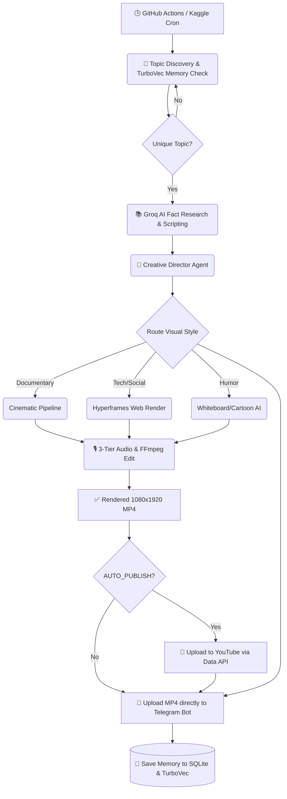

<div align="center">
  

  # 🚀 SensorySlice: Autonomous YouTube Shorts Agent

  **A 100% Free, Fully Autonomous AI Channel Automation Pipeline**

  [](https://github.com/features/actions)
  [](https://www.kaggle.com/)
  [](https://core.telegram.org/bots)
  [](#)

</div>

---

## 🌟 What is this?

**SensorySlice** is a completely autonomous YouTube channel manager. You set it up once, and it will run forever. 

Every day, the agent wakes up and:
1. 🧠 **Brainstorms** a highly engaging, viral curiosity topic.
2. 🕵️‍♂️ **Researches** the facts and writes a fast-paced, retention-engineered script.
3. 🔬 **Fact-Checks** itself using AI. If confidence is below 80%, it rewrites the script.
4. 🎙️ **Synthesizes** a realistic AI voiceover using Microsoft Edge Neural TTS.
5. 🖼️ **Sources** copyright-free background videos from Pexels API.
6. 🎬 **Edits** the final video (1080x1920 9:16) using FFmpeg, adding background music and perfectly timed, dynamic captions.
7. 🚀 **Uploads** the final video to YouTube via the official YouTube Data API.
8. 📲 **Notifies** you via Telegram, uploading the `.mp4` straight to your phone.

**Best of all? It costs exactly $0.00 to run.**

### 🔄 Architecture & Workflow Diagram



---

## ✨ Core Features

- 💸 **100% Free Stack**: Uses `Groq (Llama-3.1)` (Blazing Fast Free Tier) for scripting, `Gemini 1.5 Flash` for real-time autonomous trend brainstorming, Pexels API (Free), Edge-TTS (Free), Playwright (Free Web Rendering), and FFmpeg (Open Source).
- 🧠 **Dynamic Dual-LLM Intelligence**: The agent actively monitors internet trends. If the internet is slow, it automatically falls back to Gemini to hallucinate 100% brand new, highly obscure topics across 17 categories (Gaming, Sports, Science, etc.).
- 🎭 **4 Visual Render Pipelines**: The agent routes topics to one of four completely distinct visual styles:
  1. `CinematicPipeline`: High-end documentary style with letterboxing, color-graded footage, and ambient music.
  2. `HyperframesPipeline`: Web-rendered Playwright engine building custom HTML/CSS dynamic UI animations (like Reddit or HackerNews styles).
  3. `WhiteboardPipeline`: Doodle/stickman visual explainer using Pollinations AI.
  4. `CartoonPipeline`: 3D animated character styles using Pollinations AI.
- 💾 **Semantic Deduplication**: The agent builds a semantic index of its memory using `TurboVec` and mathematically blocks duplicate topics via vector distance, ensuring it **never** uploads the same video twice.
- 🎙️ **3-Tier Audio Engine**: Automatically cascades between local VoiceStudio (OpenAI TTS), Microsoft Edge-TTS, and offline Windows Pyttsx3. Generates its own procedural FFmpeg sine-wave music if you don't provide background tracks!
- ⚡ **Automated Playwright Actions**: The GitHub Actions CI/CD automatically installs Chromium binaries to support headless web-UI rendering.
- 📱 **Telegram Bot Integration**: Directly uploads the finished AI video to your Telegram chat immediately after rendering.

---

## 🏗️ Deployment Options (Choose Your Weapon)

We built three different ways to run this agent depending on your needs.

### Option A: GitHub Actions (Recommended for 100% Set-and-Forget)
The ultimate hands-off approach. The code runs on Microsoft's servers entirely for free.
- **Schedule:** Configured to run automatically 4 times a day (`0 */6 * * *`).
- **Memory:** Uses `actions/cache` to persist the agent's SQLite brain and TurboVec embeddings across ephemeral runs.
- **Setup:** Add your API Keys (`GEMINI_API_KEY`, `PEXELS_API_KEY`, `TELEGRAM_BOT_TOKEN`, `TELEGRAM_CHAT_ID`) and your base64-encoded Google OAuth files to your GitHub Repository Secrets.

### Option B: Kaggle Notebooks (Recommended for Blazing Fast GPU Rendering)
Need the videos rendered in 10 seconds instead of 10 minutes? Run it on a free NVIDIA T4 GPU.
- **Schedule:** Can be scheduled daily using Kaggle's built-in cron.
- **Memory:** Zips the `data/` folder into an `agent_memory_backup.zip` that can be fed back into the notebook as a Private Dataset.
- **Setup:** Create a Kaggle Notebook, enable GPU T4, load your API keys into Kaggle Secrets, and paste the `shorts_agent_kaggle.ipynb` code.

### Option C: Local Windows/Mac/Linux
Want to watch the magic happen live on your own machine?
1. Clone the repo and install dependencies: `pip install -r requirements.txt`.
2. Add your `.env` file with your API keys.
3. Run `python app.py run-agent` and watch the CLI output!

---

## 🛠️ Required API Keys & Secrets

To get this running for free, you need to grab the following keys and add them to your environment variables or Secrets:

| Secret Name | Where to get it | Cost |
| :--- | :--- | :--- |
| `GROQ_API_KEY` | [Groq Console](https://console.groq.com/) | Free |
| `GEMINI_API_KEY` | [Google AI Studio](https://aistudio.google.com/) | Free (Optional Fallback) |
| `PEXELS_API_KEY` | [Pexels Developers](https://www.pexels.com/api/) | Free |
| `TELEGRAM_BOT_TOKEN`| Message `@BotFather` on Telegram | Free |
| `TELEGRAM_CHAT_ID` | Message your Bot, then check `api.telegram.org/bot<TOKEN>/getUpdates` | Free |
| *(YouTube OAuth)* | Google Cloud Console (Desktop App Credentials) | Free |

*(Note: YouTube Auto-Publish requires generating `client_secrets.json` and a `token.pickle` file locally first, then encoding them to base64 for GitHub/Kaggle secrets.)*

---

## 📁 Repository Structure

```text
├── app.py                     # The main entrypoint
├── requirements.txt           # Python dependencies
├── .github/workflows/         # GitHub Actions pipeline (runs 4x a day)
├── backend/
│   ├── core/                  # Configuration, Database, and Orchestrator
│   ├── agents/                # LLM Agents (TrendScout, ScriptWriter, FactChecker)
│   ├── services/              # API wrappers (YouTube, Telegram, FFmpeg, TTS)
│   └── memory/                # TurboVec embedding engine & SQLite manager
├── projects/                  # Rendered MP4s and scripts go here
└── credentials/               # Google OAuth files go here
```

---

## 🤖 The Self-Improvement Loop

At the end of every day, the agent runs a **Daily Review**. 
It analyzes the performance of its own videos, updates the weights of its `portfolio_mix` (e.g., doing more Science videos if History isn't performing), and records its findings in its permanent `shorts_agent.db`. This means the longer you leave the agent running, the smarter it gets at picking topics!

---

<div align="center">
  <i>Built with ❤️ by <b>Manoj Venaram</b>.</i>
</div>
